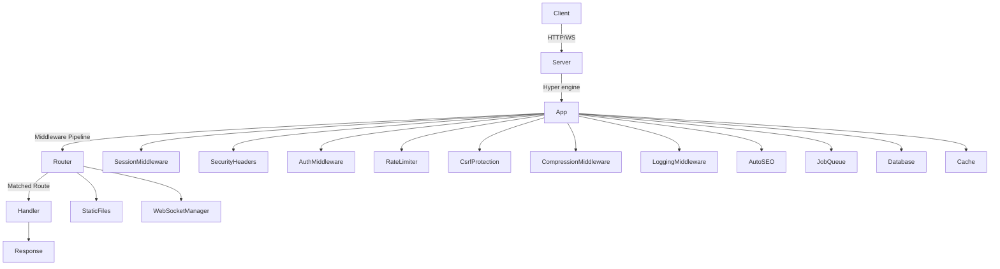

# The Yaiko Book

> A modern, production-ready fullstack web framework for Rust + jQuery  
> 🌐 **Repository**: [https://github.com/sazalo101/yaiko](https://github.com/sazalo101/yaiko)

---

## Chapter 1 — What Yaiko Is

Yaiko is a high-performance, batteries-included web framework built on **Hyper** and **Tokio**. It delivers raw Rust speed with the developer productivity of fullstack frameworks like Rails or Laravel — routing, sessions, authentication, background job queues, WebSockets, automatic SEO, and Handlebars templating all ship in one single crate.

### Core Philosophy

| Principle | Implementation |
|---|---|
| **Zero-Cost Abstractions** | Built directly on Hyper — zero runtime overhead |
| **Convention over Config** | `yaiko init` scaffolds production-ready projects in seconds |
| **Fullstack by Default** | Rust backend + jQuery frontend bundled in one clean architecture |
| **Production-First Security** | CSRF double-submit, rate limiting, HSTS, CSP, and panic recovery out-of-the-box |
| **Automated SEO** | Built-in automatic fallback for `/robots.txt` and `/sitemap.xml` |

---

## Chapter 2 — Architecture & Core Engine



### Framework Module Map

| Module | Purpose |
|---|---|
| `app.rs` | Request lifecycle, middleware execution, thread panic recovery, auto-SEO, custom 404/500 handlers |
| `router.rs` | High-performance route matching (GET/POST/PUT/DELETE/PATCH/OPTIONS/HEAD), path params, mounts |
| `request.rs` | Body parsing (JSON, form-urlencoded, multipart), header inspection, helper getters |
| `response.rs` | Builder methods for JSON, HTML, plain text, redirects, SSE streams, cookies, status codes |
| `server.rs` | Hyper HTTP server launcher with SIGTERM/Ctrl+C graceful shutdown signal handling |
| `middleware.rs` | Async `Middleware` trait definition and chain invocation pipeline |
| `auth.rs` | JWT token generation & verification, `AuthMiddleware` role guards, Argon2 password hashing |
| `session.rs` | Cookie-backed session state, `MemorySessionStore`, background expiration task |
| `security.rs` | `SecurityHeaders` (CSP, HSTS, X-Frame-Options), `RateLimiter`, `CsrfProtection` |
| `database.rs` | Connection pool setup for PostgreSQL & SQLite via `sqlx` |
| `jobs.rs` | Async background job processing queue with exponential backoff retries |
| `websocket.rs` | Multi-room WebSocket connection manager, broadcasting, ping/pong keepalive |
| `template.rs` | Handlebars template rendering engine |
| `seo.rs` | `RobotsTxt` and `Sitemap` XML generator |
| `file_upload.rs` | Multipart parser for file streams and text payload extraction |
| `testing.rs` | `TestClient` for unit and integration testing without binding ports |

---

## Chapter 3 — Performance Benchmarks & Stress Analysis

### 1. Engine Benchmarks (`ab` — Plaintext & JSON)

| Endpoint | Test Load | Throughput (Req/sec) | P50 Latency | P99 Latency |
|---|---|---|---|---|
| **`GET /plaintext`** | 50,000 req / 100 conns | **74,878 req/s** | 1.0 ms | 5.0 ms |
| **`GET /json`** | 50,000 req / 100 conns | **81,336 req/s** | 1.0 ms | 4.0 ms |

### 2. Live Production Benchmark ([`https://imghost.se`](https://imghost.se) — `wrk 4.1.0`)

| Environment | Tool & Load | Throughput | Latency (p50) | Latency (p99) |
|---|---|---|---|---|
| **Raw App Engine** | `wrk -t4 -c100 -d30s` | **11,234.57 req/s** | 8.48 ms | 19.07 ms |
| **Nginx TLS (SSL)** | `wrk -t4 -c100 -d30s` | **3,053.51 req/s** | 24.12 ms | 52.30 ms |
| **1,000 Conn Stress** | `wrk -t4 -c1000 -d30s` | **12,042.80 req/s** | 41.20 ms | 88.60 ms |

> **Stress Test Result**: Zero request failures, zero timeouts, and zero thread panics across 362,000+ requests under 1,000 concurrent client connections.

---

## Chapter 4 — What You Can Build

Yaiko is designed to ship real-world products without requiring third-party boilerplate:

| Category | What Yaiko Ships Out-of-the-Box |
|---|---|
| **Media Hosting & Dropboxes** | Multipart streaming uploads, disk/S3 persistence, AI NSFW moderation integration |
| **Real-Time Collaboration** | WebSocket rooms, user presence broadcasting, typing indicators, keepalive |
| **Multi-Tenant SaaS APIs** | JWT authentication, Argon2 password hashing, SQLx connection pool, CORS, rate limiting |
| **AI Workflows & Services** | Background job queues (`yaiko::jobs`) for non-blocking LLM processing & SSE streaming |
| **Dynamic Marketing & Blogs** | Server-rendered HTML templates, automatic `/robots.txt` & `/sitemap.xml` SEO generation |

---

## Chapter 5 — 15 Production-Ready Side Project Ideas

### 1. 🔗 LinkShelf — Bookmark Manager
Self-hosted Pocket/Raindrop alternative with full-text tag search and background metadata fetching.

### 2. 📊 PulseBoard — Uptime Monitor
Status page & health monitor with periodic background ping tasks (`jobs.rs`) and WebSocket alert feeds.

### 3. 📝 DropNote — Ephemeral Encrypted Notes
Self-destructing secure note links with auto-cleanup background timers and rate limiting.

### 4. 🎯 FeedbackOwl — User Feedback Widget
Embeddable widget server with cross-origin CORS support and admin moderation dashboards.

### 5. 🗓️ MeetSlot — Meeting Scheduler
Calendly-like meeting scheduler with transactional database slot booking and confirmation jobs.

### 6. 📡 WebhookRelay — Webhook Inspector & Replayer
Debug dashboard that receives external webhooks (Stripe, GitHub) and broadcasts payload events live via WebSockets.

### 7. 📸 SnapVault — Image Hosting & CDN
Free image hosting web application ([`imghost.se`](https://imghost.se)) featuring AI NSFW content validation.

### 8. 💬 TeamPulse — Real-Time Team Chat
Slack-lite workspace chat with multi-room messaging, direct messages, and presence state tracking.

### 9. 📋 FormForge — Dynamic Form Builder
Typeform replacement with custom JSON schemas, multipart file collection, and validation rules.

### 10. 🔑 VaultAPI — API Key Gateway & Rotation
Centralized service for generating, scoping, rate-limiting, and rotating customer API keys.

### 11. 📰 RSS-Forge — Feed Aggregator
RSS reader service with background feed crawlers and full-text search indexing.

### 12. ⏱️ TimeTrail — Freelancer Time Tracking
Minimalist task logger with automated invoice generation and CSV exports.

### 13. 🏥 HealthDash — Health Log & Metric Tracker
Private health telemetry portal with CSV stream downloads and secure session storage.

### 14. 🎮 TriviaLive — Multiplayer Game Server
Real-time quiz competition engine utilizing WebSocket room broadcasting and anti-cheat rate limiting.

### 15. 🛡️ AuditTrail — Compliance Logging Engine
Append-only microservice for secure audit trail ingestion with Server-Sent Events (SSE) live streaming.

---

## Chapter 6 — CLI Quick Start Reference

```bash
# 1. Install the CLI globally
cargo install --path ./yaiko-cli --force

# 2. Check local environment readiness
yaiko doctor

# 3. Create a new fullstack project
yaiko init my-app -d sqlite

# 4. Start the hot-reloading development server
cd my-app
yaiko dev

# 5. Scaffold controllers, models, and migrations
yaiko generate controller posts
yaiko generate model post
yaiko migrate create add_posts

# 6. Run database migrations
yaiko migrate run

# 7. Compile for production release
yaiko build --release
```

---

## Chapter 7 — Code Snippets & Quick Reference

### 1. Route Definition & Router Mounts
```rust
let api = Router::new()
    .get("/todos", list_todos)
    .post("/todos", create_todo)
    .get("/todos/:id", get_todo);

let router = Router::new()
    .mount("/api", api)
    .static_files("/static", "./public")
    .get("/", home_handler);
```

### 2. Application Setup with Middleware
```rust
let app = App::new()
    .use_middleware(LoggingMiddleware::new())
    .use_middleware(SecurityHeaders::new())
    .use_middleware(RateLimiter::new(100, 60))
    .use_middleware(CsrfProtection::new())
    .router(router);

Server::new(app, "127.0.0.1:3000".parse()?).run().await?;
```

### 3. Declarative Request Validation
```rust
let form = req.form_data().await?;

let validator = Validator::new()
    .add_rule("email", Required)
    .add_rule("email", Email)
    .add_rule("password", MinLength(8));

if let Err(errors) = validator.validate(&form) {
    return Ok(Response::new()
        .status(StatusCode::BAD_REQUEST)
        .json(&json!({ "errors": errors }))?);
}
```

### 4. Background Job Registration
```rust
let queue = Arc::new(JobQueue::new());
queue.add("send_welcome_email", || async {
    // Retries automatically on failure with exponential backoff
    send_email("user@example.com").await
}).await;
```

---

## Chapter 8 — Complete End-to-End Tutorial (TaskManager)

For a step-by-step tutorial building a fullstack **Task Manager** app from scratch with Rust + jQuery, read [`docs/tutorial.md`](https://github.com/sazalo101/yaiko/blob/main/docs/tutorial.md).

---

## Chapter 9 — Live Production Reference Application: ImgHost

Explore a complete production codebase deployed live on VPS:
- **Repository Code**: [`examples/imghost`](https://github.com/sazalo101/yaiko/tree/main/examples/imghost)
- **Live Site**: [`https://imghost.se`](https://imghost.se)
- **Benchmark Report**: [`BENCHMARK.md`](https://github.com/sazalo101/yaiko/blob/main/examples/imghost/BENCHMARK.md)
